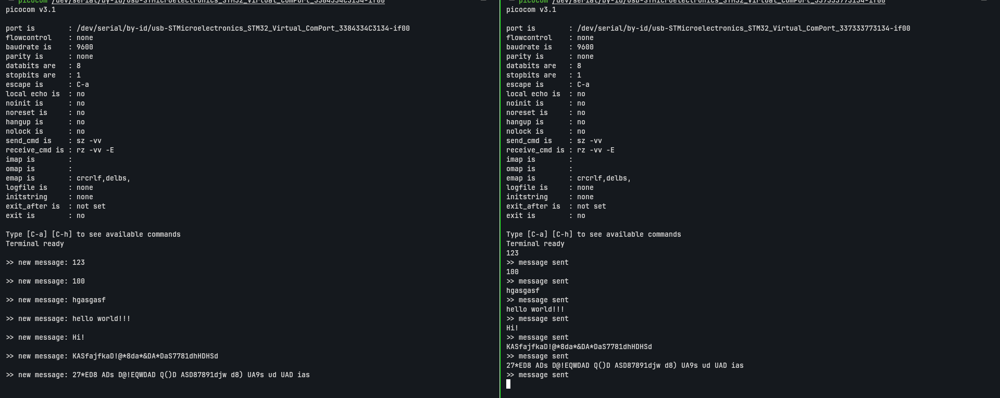
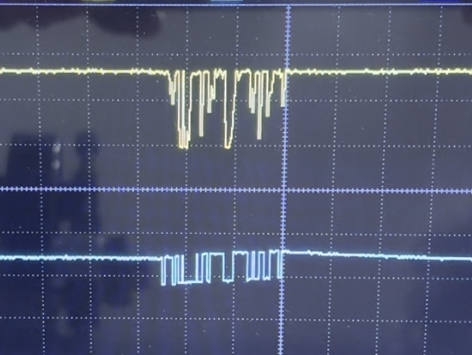

# stm32-fso-laser-link

[](https://github.com/bar4nka-pro/stm32-fso-laser-link/actions/workflows/ci.yml)

Firmware for a point-to-point free-space optical (FSO) data link between two
STM32F411 microcontrollers. Text entered on one host is framed, transmitted through
open air by a modulated 650 nm laser, received by a photodiode front-end, verified and
delivered to a second host.

The repository contains the framing protocol, the transmitter and receiver firmware,
a host-side unit test suite and the CI pipeline. The optical hardware originates from
a bachelor's thesis on asynchronous data transfer over a free-space optical channel.

---

## Contents

- [Link topology](#link-topology)
- [Hardware](#hardware)
- [Wire protocol](#wire-protocol)
- [Repository layout](#repository-layout)
- [Building](#building)
- [Flashing](#flashing)
- [Usage](#usage)
- [Testing](#testing)
- [Continuous integration](#continuous-integration)
- [Status](#status)
- [Known limitations](#known-limitations)
- [Roadmap](#roadmap)

---

## Link topology

```
Host A ── USB CDC ──► STM32F411 #1 (transmitter)
                           │ USART1 TX, PA9, 1200 baud
                           ▼
                      laser driver ──► 650 nm laser diode
                                              │
                            ≈≈≈ free space ≈≈≈
                           ▼
                      photodiode
                           │ USART1 RX, PA10
                           ▼
Host B ◄── USB CDC ── STM32F411 #2 (receiver)
```

The optical channel carries a standard asynchronous serial waveform. The USART
peripheral provides bit timing, the transmit line switches the laser, and the receiver
front-end restores a logic-level signal for the RX pin. There is no line coding or
clock recovery at the physical layer; frame delimiting and integrity checking are
handled by the protocol layer described below.

### Photographs

| Transmitter | Receiver |
|---|---|
|  |  |
| STM32F411 and laser driver | Photodiode and load resistor |


*Complete link on the bench*


*Transmitter console (right) and decoded output on the receiver (left)*

---

## Hardware

| Item | Value |
|---|---|
| MCU (both ends) | STM32F411CEU6 — Cortex-M4F, 512 KB flash, 128 KB SRAM |
| Board | WeAct Black Pill |
| Optical channel | USART1, 1200 baud, 8N1, no flow control |
| Transmit pin | PA9 (USART1_TX) → laser driver |
| Receive pin | PA10 (USART1_RX) ← photodiode front-end |
| Activity LED | PC13, active low, lit while a frame is being processed |
| Host interface | USB 2.0 full-speed, CDC ACM (virtual COM port) |
| Emitter | SYD1230 laser module — 650 nm, 5 mW class, 3–5 V supply |
| Detector | FD-7K (ФД-7К) silicon photodiode, reverse-biased, 15.5 kΩ load resistor, read directly by PA10 |
| Debug | SWD (SWDIO, SWCLK, GND, 3V3); NRST not connected |

**Clocking.** The 25 MHz HSE crystal drives the PLL, whose Q output supplies the 48 MHz
USB clock. SYSCLK, and with it both APB buses, is currently taken from the 16 MHz HSI —
see [Known limitations](#known-limitations).

**Receiver front-end.** There is no external comparator or amplifier. The voltage across
the photodiode load resistor drives PA10 directly, and the pin's built-in input Schmitt
trigger acts as the slicer. Per the STM32F411 datasheet (Table 53, FT I/O), at
VDD = 3.3 V the input is guaranteed to read low below 0.3 VDD ≈ 1.0 V and high above
0.7 VDD ≈ 2.3 V, with a typical hysteresis of 10 % VDD (at least 200 mV). The
photodiode signal must therefore cross this whole band within one bit time; the load
resistor value trades sensitivity against the RC time constant of the front-end.

### Resource usage

Debug build (`-O0 -g3`), `arm-none-eabi-gcc` 16.2.0:

| Image | Flash (text + data) | RAM (data + bss) |
|---|---|---|
| Transmitter | 30 884 B — 5.9 % | 9 104 B — 6.9 % |
| Receiver | 33 112 B — 6.3 % | 9 704 B — 7.4 % |

Exact figures vary by a few hundred bytes between toolchain and newlib versions; RAM use
on the receiver includes the 8-slot message queue (520 B).

---

## Wire protocol

The framing layer is implemented once in `shared/laser_proto/` and compiled unchanged
into both firmware images and the host test binary, so the code under test is the code
that runs on the target.

### Frame format

```
┌────────┬────────┬────────┬──────────────────┬──────────┐
│ SYNC1  │ SYNC2  │  LEN   │    DATA[LEN]     │ CHECKSUM │
│  0xAA  │  0x55  │ 1..64  │                  │          │
└────────┴────────┴────────┴──────────────────┴──────────┘
   1 B      1 B      1 B        LEN bytes         1 B
```

| Field | Size | Description |
|---|---|---|
| `SYNC1`, `SYNC2` | 2 B | Preamble `0xAA 0x55`; marks a frame boundary in an arbitrary byte stream |
| `LEN` | 1 B | Payload length, 1–64; zero and oversized values are rejected |
| `DATA` | `LEN` B | Payload; any byte value is permitted |
| `CHECKSUM` | 1 B | XOR of `LEN` and all payload bytes |

Per-frame overhead is 4 bytes and the maximum payload is 64 bytes (68-byte frame). Both
limits are defined in `laser_proto.h` as `MAX_PAYLOAD` and `OVERHEAD`.

### Design decisions

**Explicit length rather than a terminator.** The payload is fully byte-transparent,
including values equal to the preamble and `0x00`. Transparency is verified on the
physical link: payloads such as `41 00 42`, `58 AA 55 59` and `FF FF FF` are delivered
unaltered.

**Length is covered by the checksum.** The checksum is seeded with `LEN`, so a corrupted
length field causes a checksum failure rather than a frame of the wrong size.

**Resynchronisation.** The decoder is a five-state machine
(`SYNC1 → SYNC2 → LENGTH → DATA → CHECKSUM`) that returns to the search state after every
frame, accepted or rejected. Leading noise is discarded, and a repeated preamble byte is
handled correctly: in `AA AA 55`, the second `0xAA` holds the decoder in the `SYNC2`
state, so the sequence still opens a frame.

**Sans-I/O.** The decoder performs no peripheral access. It consumes one byte per call
and returns a result — `IDLE`, `PACKET`, `BAD_CRC` or `BAD_LEN` — which makes it testable
on a host without hardware.

---

## Repository layout

```
.
├── CMakeLists.txt               # root project: firmware or host-test configuration
├── cmake/
│   ├── arm-none-eabi.cmake      # cross-compilation toolchain file
│   └── stm32f411_firmware.cmake # shared firmware target definition
├── shared/laser_proto/          # framing layer (C), used by both images and the tests
├── transmitter/                 # transmitter: USB CDC console, framing, USART1 TX
├── receiver/                    # receiver: interrupt-driven USART1 RX, decoding, message queue, USB CDC
├── tests/                       # GoogleTest suite for laser_proto
└── .github/workflows/ci.yml     # CI: host tests and firmware build
```

The root `CMakeLists.txt` selects its configuration from `CMAKE_CROSSCOMPILING`: with the
toolchain file it builds the two firmware images, without it the host test suite. Both
firmware targets are produced by a single CMake function, so compiler flags, include
paths and post-build steps (`.bin`, `.hex`, size report) are defined in one place.

`Drivers/`, `Middlewares/` and `USB_DEVICE/` contain STM32Cube HAL and USB device
middleware. The build system is maintained by hand and is the supported way to build the
project; sources are not regenerated from CubeMX.

---

## Building

**Requirements:** CMake ≥ 3.20, Ninja, Arm GNU Toolchain (`arm-none-eabi-gcc`), and a
host C/C++ compiler for the tests.

**Host tests**

```sh
cmake -S . -B build-host -G Ninja
cmake --build build-host
ctest --test-dir build-host --output-on-failure
```

**Firmware**

```sh
cmake -S . -B build -G Ninja -DCMAKE_TOOLCHAIN_FILE=$PWD/cmake/arm-none-eabi.cmake
cmake --build build
```

Outputs: `build/transmitter/transmitter.{elf,bin,hex}` and
`build/receiver/receiver.{elf,bin,hex}`.

The toolchain file is evaluated before `project()` and must be supplied when configuring
an empty build directory.

---

## Flashing

**st-flash**

```sh
st-flash --connect-under-reset --reset write build/transmitter/transmitter.bin 0x08000000
```

**OpenOCD**

```sh
openocd -f interface/stlink-dap.cfg \
        -c "transport select dapdirect_swd" \
        -f target/stm32f4x.cfg \
        -c "reset_config none separate" \
        -c "program build/transmitter/transmitter.elf verify reset exit"
```

NRST is not wired on these boards, so `reset_config none separate` makes OpenOCD reset
the core through AIRCR. The `stlink-dap` interface is required for that reset path; the
legacy `stlink` (HLA) interface does not provide it.

Without `program … exit`, OpenOCD remains running and serves GDB on port 3333 and a
command console on port 4444, which can be used to inspect peripheral registers on a
running target.

**USB DFU (no debug probe)**

The STM32F411 system bootloader exposes a DFU device (`0483:df11`) when the chip starts
with BOOT0 high: hold BOOT0, press and release NRST, release BOOT0.

```sh
dfu-util -l                                                   # list DFU devices
dfu-util -S <serial> -a 0 -s 0x08000000:leave -D build/receiver/receiver.bin
```

`-S` selects the board by its USB serial number when both are in DFU mode at once;
`:leave` starts the application after programming. Entry into DFU is not always
successful on the first attempt on these boards — if the host reports enumeration
errors, repeat the BOOT0/NRST sequence. DFU only programs flash; debugging still
requires SWD.

---

## Usage

Both boards enumerate as USB CDC devices (`/dev/ttyACM*` on Linux, `/dev/cu.usbmodem*`
on macOS). Open each port with any serial terminal; the baud rate setting is ignored by
CDC.

On the **transmitter** console, input is line-edited:

| Input | Action |
|---|---|
| printable characters | appended to the line and echoed |
| Backspace / DEL | removes the last character |
| Enter (CR or LF) | sends the line as one frame; the console replies `>> message sent` |
| any character beyond 64 | rejected; the console emits BEL (`0x07`) |

The **receiver** prints each verified frame as `>> new message: <payload>`.

### Receiver data path

```
USART1 RX interrupt ──► decoder ──► message queue (8 slots) ──► main loop ──► USB CDC
     one byte per IRQ    laser_proto    head: written by the ISR      tail: written by main
```

The decoder runs in the USART interrupt, one byte per call. Each verified payload is
copied into a single-producer, single-consumer ring of eight message slots. The main loop
copies the oldest slot into its own buffer, releases the slot and only then writes it to
USB, so the interrupt never modifies data that is being printed. Each index is written by
exactly one side, so no interrupt masking is required.

One slot is always kept free to distinguish a full queue from an empty one, giving a
capacity of seven pending messages. When the queue is full, the new message is dropped
and counted in `lost_counter`.

---

## Testing

### Unit tests

Nine GoogleTest cases (GoogleTest 1.15.2, fetched at configure time, registered with
CTest) cover the framing layer:

| Test | Verifies |
|---|---|
| `RoundTrip` | a built frame decodes to the original payload |
| `BuildFrameRejectsBadArgs` | null pointers, zero or oversized length, insufficient output buffer |
| `BadChecksumIsRejected` | a corrupted payload byte yields `BAD_CRC` |
| `ZeroLengthIsRejected` | `LEN = 0` yields `BAD_LEN` |
| `TooBigLengthIsRejected` | `LEN > MAX_PAYLOAD` yields `BAD_LEN` |
| `GarbageBeforeFrameIsIgnored` | leading noise does not prevent decoding |
| `DoubleSyncByteIsAccepted` | `AA AA 55` opens a frame |
| `PayloadMayContainPreamble` | payload bytes equal to the preamble are transparent |
| `RecoverAfterBadFrame` | the decoder resynchronises after a rejected frame |

The tests are written in C++ to use GoogleTest; the protocol implementation remains C and
is linked into the test binary unmodified.

### Link verification

End-to-end tests drive the transmitter's CDC port and read the receiver's directly
through raw `termios` access, keeping the terminal emulator out of the data path — a
UTF-8 terminal substitutes invalid single bytes such as `0xAA` and would report
corruption that the link did not cause.

| Run | Frames | Payload bytes | Checksum failures |
|---|---|---|---|
| September 2026, 1200 baud | 15 / 15 | 240 | 0 |
| October 2026, 1200 baud, with receiver message queue | 15 / 15 | 240 | 0 |

Each run includes payloads containing preamble bytes and a full 64-byte payload. Test
payloads exclude `0x08`, `0x0A`, `0x0D` and `0x7F`, which the transmitter console
interprets as editing commands rather than data.

A 68-byte frame takes 567 ms on the wire at 1200 baud (10 bits per byte), so the
harness must wait at least that long after the line terminator before reading the result.

### Link speed

Both firmware images were rebuilt and run at 2400 and 9600 baud, with the configured rate
confirmed on hardware: the transmitter sends each frame with a blocking call, so the
interval between the line terminator and the `>> message sent` reply equals the frame
duration, `(LEN + 4) × 10 / baud`.

| Path | 1200 baud | 2400 baud | 9600 baud |
|---|---|---|---|
| Direct wire, PA9 → PA10 | — | — | full test set passed |
| Optical: laser → free space → photodiode → PA10 | full test set passed | no frame received | no frame received |

With the wire in place of the optical path, the complete boundary-case set passes at
9600 baud: payloads containing `0x00`, `0xFF` and preamble bytes, exactly 64 bytes,
65-byte input truncated to 64, 15 random 16-byte frames and 15 random 64-byte frames.
Over the optical path at 2400 and 9600 baud not a single frame is decoded, including
a 5-byte payload. The firmware, protocol and receiver queue are therefore not the
limiting factor at these rates; the optical path is, and its usable rate lies between
1200 and 2400 baud.

The limitation is attributed to the transmitter side — the SYD1230 laser module and its
drive. The photodiode front-end was dimensioned with roughly fourfold margin on its
bandwidth constraint (15.5 kΩ load against a 55–63 kΩ upper limit), and pulse smearing
on the laser side was observed on the oscilloscope during the original bench work, which
is why 1200 baud was chosen. An edge-level measurement that isolates the emitter (for
example, the same PA9 signal driving an LED of known speed onto the same photodiode) has
not been performed yet.


*Transmission of `Hello world!` over the optical path at 1200 baud: CH2 (blue) — laser drive
signal from PA9, CH1 (yellow) — photodiode signal at the receiver*

### Receiver queue verification

The receiver's output path was slowed artificially (3 s per message) to force messages
to arrive while the previous one was still being printed:

| Scenario | Expected | Observed |
|---|---|---|
| 3 messages within one output window | all delivered, in order | all delivered, in order; `lost_counter = 0` |
| 12 messages within 2 s | first delivered at once, 7 queued, 4 dropped | messages 1–8 delivered in order; `lost_counter = 4` |

Before the queue was introduced, the same test printed the second message's payload
under the first message's header: the first message was overwritten and the second never
got its own line, with no indication of either loss. Counters were read from the running target over SWD.

---

## Continuous integration

`.github/workflows/ci.yml` runs on every push and pull request to `main`, as two
independent jobs on `ubuntu-latest`:

| Job | Steps |
|---|---|
| `host-tests` | configure, build, run the CTest suite |
| `firmware` | install `gcc-arm-none-eabi`, build both images, report section sizes, publish both `.bin` files as the `firmware-bin` artifact |

Build outputs are not committed; prebuilt images are available as CI artifacts.

---

## Status

Implemented and verified on hardware:

- Framing layer with unit tests; byte transparency confirmed on the optical link.
- Reproducible firmware builds from a hand-maintained CMake configuration, locally and in
  CI.
- Transmitter: USB CDC line console with echo, editing, input-length enforcement and
  framed transmission.
- Receiver: interrupt-driven reception, incremental decoding, an 8-slot message queue
  between the interrupt and the main loop, output of verified frames to the host.
- End-to-end link operation at 1200 baud.

---

## Known limitations

| Area | Description |
|---|---|
| USB input | The CDC receive callback forwards only the first byte of each USB packet, through a single shared byte; additional bytes in the same packet, or bytes arriving before the main loop reads the previous one, are dropped. Pasted input is therefore incomplete. |
| Shared state | The byte handed from the USB callback to the main loop is not declared `volatile`. |
| Blocking transmission | The transmitter sends each frame with a blocking `HAL_UART_Transmit` — up to 567 ms at 1200 baud — during which USB input is not consumed, which aggravates the input loss above. |
| Receiver error recovery | No `HAL_UART_ErrorCallback` is provided. After a USART overrun the HAL aborts reception and nothing restarts it; the receiver stays silent until reset. Identified by code review, not yet reproduced. Framing and noise errors do not stop reception, but are not counted. |
| Error reporting | Frames rejected with `BAD_CRC` or `BAD_LEN` are discarded without being counted. Messages dropped on a full receiver queue are counted in `lost_counter`, but the counter is not yet reported to the host. |
| Frame timeout | The decoder has no inter-byte timeout: after a truncated frame it keeps collecting payload bytes, so the next frame is consumed as the remainder of the broken one (see `RecoverAfterBadFrame`). |
| Link speed | The optical path does not operate above 1200 baud: at 2400 and 9600 baud no frame is received, while the same firmware passes all tests at 9600 baud over a direct wire. The limitation is attributed to the laser module; see [Link speed](#link-speed). |
| Integrity check | A single-byte XOR detects all single-bit errors but misses an even number of errors in the same bit position. |
| Clocking | SYSCLK runs from HSI at 16 MHz rather than from the PLL. The PLL is configured with its P output at 120 MHz, above the STM32F411 limit of 100 MHz; it is harmless while unused as SYSCLK, but must be reconfigured before switching. |
| USB output | The return value of `CDC_Transmit_FS` is not checked. Consecutive writes are separated by fixed `HAL_Delay()` calls; a write issued while the previous transfer is still in progress returns `USBD_BUSY` and its data is lost silently. |

---

## Roadmap

1. Optical path above 1200 baud: edge-level measurement of the laser module response,
   then a faster emitter or a dedicated laser drive stage. Ring-buffered USB reception on
   the transmitter that consumes every byte of each packet.
2. USART error recovery (`HAL_UART_ErrorCallback`) with overrun, framing and noise error
   counters.
3. Link-quality counters — rejected frames, dropped messages, USART errors — reported to
   the host as a basis for error-rate measurement.
4. USB output that waits for the previous transfer instead of fixed delays.
5. Inter-byte timeout in the decoder, so a truncated frame does not consume the next one.
6. The link test harness committed as `tools/link_test.py`.
7. CRC-8 (table-driven) in place of the XOR checksum, with standard check values in the
   test suite.
8. SYSCLK from the PLL at 96 MHz (M = 25, N = 192, P = 2, Q = 4; 3 flash wait states;
   APB1 at 48 MHz). APB2 must also be divided: at 96 MHz the USART1 baud-rate divisor for
   1200 baud (5000) exceeds the 12-bit mantissa of `BRR`.
9. Segmentation for messages longer than one frame: sequence numbers, an end-of-message
   flag, acknowledgement and retransmission — a prerequisite for file transfer.
10. Host tests on both Linux and macOS runners in CI.

---

## License

Original code in this repository — the protocol layer, firmware application code, tests,
build system and CI configuration — is released under the [MIT License](LICENSE).

Third-party components are distributed under their own licenses, included in their
respective directories:

| Component | Location | License |
|---|---|---|
| STM32F4 HAL driver | `*/Drivers/STM32F4xx_HAL_Driver` | BSD-3-Clause |
| CMSIS | `*/Drivers/CMSIS` | Apache-2.0 |
| STM32 USB Device Library | `*/Middlewares/ST/STM32_USB_Device_Library` | ST SLA0044 |

