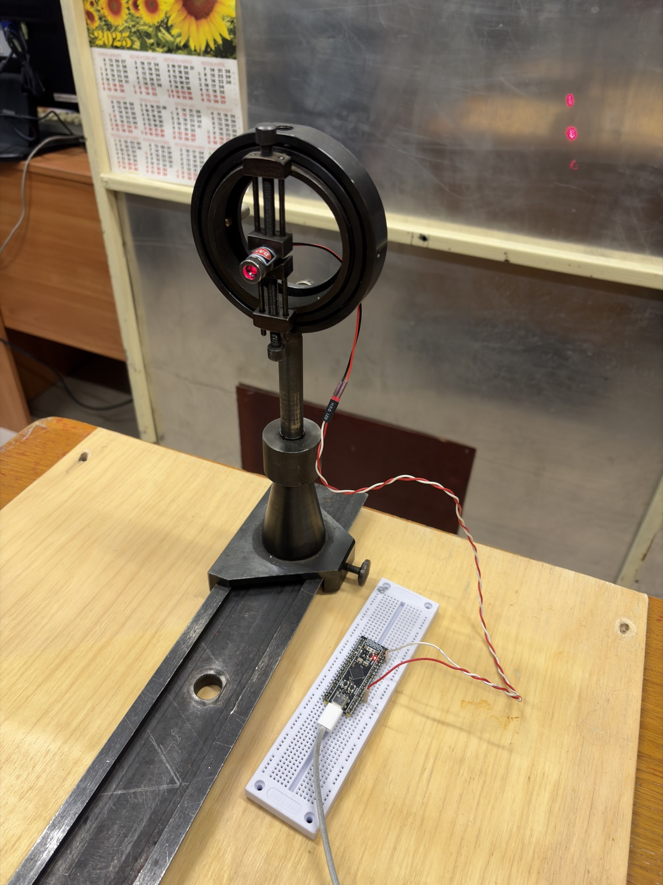
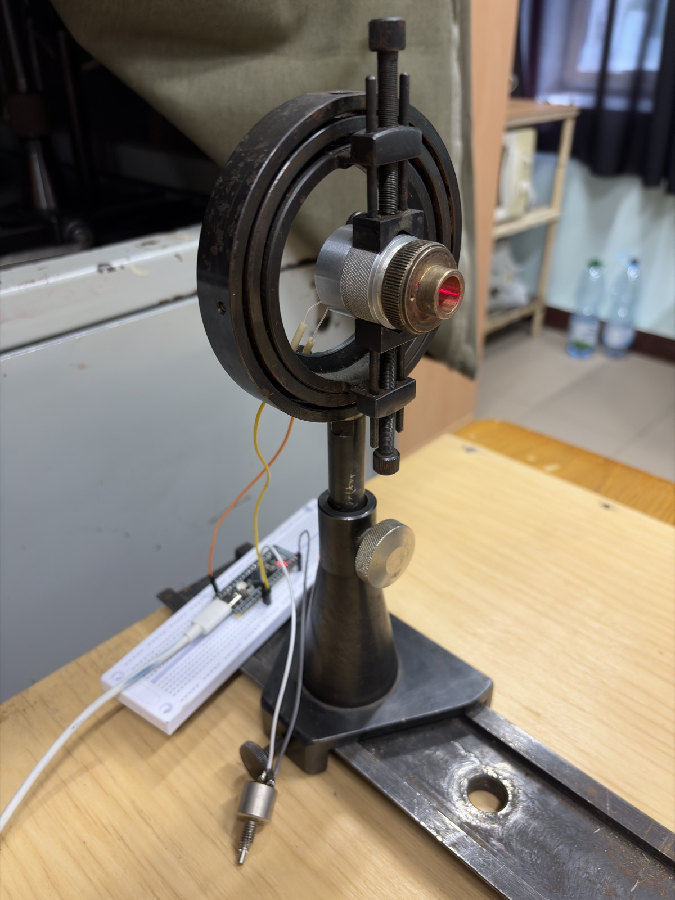
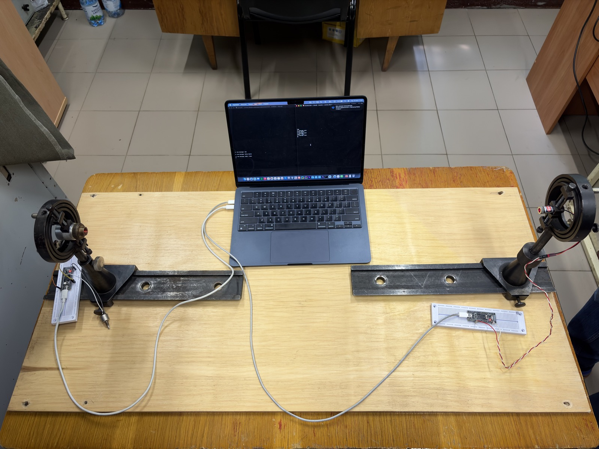
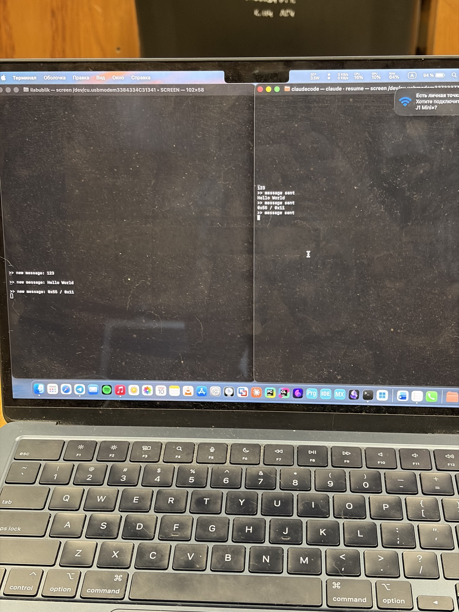

# stm32-fso-laser-link

[](https://github.com/bar4nka-pro/stm32-fso-laser-link/actions/workflows/ci.yml)

Firmware for a point-to-point free-space optical (FSO) data link between two
STM32F411 microcontrollers. Text entered on one host is framed, transmitted through
open air by a modulated 650 nm laser, received by a photodiode front-end, verified and
delivered to a second host.

The repository contains the framing protocol, the transmitter and receiver firmware,
a host-side unit test suite and the CI pipeline. The optical hardware originates from
a bachelor's thesis on asynchronous data transfer over a free-space optical channel.

---

## Contents

- [Link topology](#link-topology)
- [Hardware](#hardware)
- [Wire protocol](#wire-protocol)
- [Repository layout](#repository-layout)
- [Building](#building)
- [Flashing](#flashing)
- [Usage](#usage)
- [Testing](#testing)
- [Continuous integration](#continuous-integration)
- [Status](#status)
- [Known limitations](#known-limitations)
- [Roadmap](#roadmap)

---

## Link topology

```
Host A ── USB CDC ──► STM32F411 #1 (transmitter)
                           │ USART1 TX, PA9, 1200 baud
                           ▼
                      laser driver ──► 650 nm laser diode
                                              │
                            ≈≈≈ free space ≈≈≈
                           ▼
                      photodiode
                           │ USART1 RX, PA10
                           ▼
Host B ◄── USB CDC ── STM32F411 #2 (receiver)
```

The optical channel carries a standard asynchronous serial waveform. The USART
peripheral provides bit timing, the transmit line switches the laser, and the receiver
front-end restores a logic-level signal for the RX pin. There is no line coding or
clock recovery at the physical layer; frame delimiting and integrity checking are
handled by the protocol layer described below.

### Photographs

| Transmitter | Receiver |
|---|---|
|  |  |
| STM32F411 and laser driver | Photodiode and Schmitt trigger |


*Complete link on the bench*


*Transmitter console (right) and decoded output on the receiver (left)*

---

## Hardware

| Item | Value |
|---|---|
| MCU (both ends) | STM32F411CEU6 — Cortex-M4F, 512 KB flash, 128 KB SRAM |
| Board | WeAct Black Pill |
| Optical channel | USART1, 1200 baud, 8N1, no flow control |
| Transmit pin | PA9 (USART1_TX) → laser driver |
| Receive pin | PA10 (USART1_RX) ← photodiode front-end |
| Activity LED | PC13, active low, lit while a frame is being processed |
| Host interface | USB 2.0 full-speed, CDC ACM (virtual COM port) |
| Emitter | 650 nm laser diode |
| Detector | Photodiode with Schmitt-trigger output stage |
| Debug | SWD (SWDIO, SWCLK, GND, 3V3); NRST not connected |

**Clocking.** The 25 MHz HSE crystal drives the PLL, whose Q output supplies the 48 MHz
USB clock. SYSCLK is currently taken from the 16 MHz HSI — see
[Known limitations](#known-limitations).

### Resource usage

Debug build (`-O0 -g3`), Arm GNU Toolchain 15.3.Rel1:

| Image | Flash (text + data) | RAM (data + bss) |
|---|---|---|
| Transmitter | 31 124 B — 5.9 % | 9 104 B — 6.9 % |
| Receiver | 33 116 B — 6.3 % | 9 112 B — 7.0 % |

Exact figures vary slightly between toolchain and newlib versions.

---

## Wire protocol

The framing layer is implemented once in `shared/laser_proto/` and compiled unchanged
into both firmware images and the host test binary, so the code under test is the code
that runs on the target.

### Frame format

```
┌────────┬────────┬────────┬──────────────────┬──────────┐
│ SYNC1  │ SYNC2  │  LEN   │    DATA[LEN]     │ CHECKSUM │
│  0xAA  │  0x55  │ 1..64  │                  │          │
└────────┴────────┴────────┴──────────────────┴──────────┘
   1 B      1 B      1 B        LEN bytes         1 B
```

| Field | Size | Description |
|---|---|---|
| `SYNC1`, `SYNC2` | 2 B | Preamble `0xAA 0x55`; marks a frame boundary in an arbitrary byte stream |
| `LEN` | 1 B | Payload length, 1–64; zero and oversized values are rejected |
| `DATA` | `LEN` B | Payload; any byte value is permitted |
| `CHECKSUM` | 1 B | XOR of `LEN` and all payload bytes |

Per-frame overhead is 4 bytes and the maximum payload is 64 bytes (68-byte frame). Both
limits are defined in `laser_proto.h` as `MAX_PAYLOAD` and `OVERHEAD`.

### Design decisions

**Explicit length rather than a terminator.** The payload is fully byte-transparent,
including values equal to the preamble and `0x00`. Transparency is verified on the
physical link: payloads such as `41 00 42`, `58 AA 55 59` and `FF FF FF` are delivered
unaltered.

**Length is covered by the checksum.** The checksum is seeded with `LEN`, so a corrupted
length field causes a checksum failure rather than a frame of the wrong size.

**Resynchronisation.** The decoder is a five-state machine
(`SYNC1 → SYNC2 → LENGTH → DATA → CHECKSUM`) that returns to the search state after every
frame, accepted or rejected. Leading noise is discarded, and a repeated preamble byte is
handled correctly: in `AA AA 55`, the second `0xAA` holds the decoder in the `SYNC2`
state, so the sequence still opens a frame.

**Sans-I/O.** The decoder performs no peripheral access. It consumes one byte per call
and returns a result — `IDLE`, `PACKET`, `BAD_CRC` or `BAD_LEN` — which makes it testable
on a host without hardware.

---

## Repository layout

```
.
├── CMakeLists.txt               # root project: firmware or host-test configuration
├── cmake/
│   ├── arm-none-eabi.cmake      # cross-compilation toolchain file
│   └── stm32f411_firmware.cmake # shared firmware target definition
├── shared/laser_proto/          # framing layer (C), used by both images and the tests
├── diplom_laser/                # transmitter: USB CDC console, framing, USART1 TX
├── diplom_laser_receive/        # receiver: interrupt-driven USART1 RX, decoding, USB CDC
├── tests/                       # GoogleTest suite for laser_proto
└── .github/workflows/ci.yml     # CI: host tests and firmware build
```

The root `CMakeLists.txt` selects its configuration from `CMAKE_CROSSCOMPILING`: with the
toolchain file it builds the two firmware images, without it the host test suite. Both
firmware targets are produced by a single CMake function, so compiler flags, include
paths and post-build steps (`.bin`, `.hex`, size report) are defined in one place.

`Drivers/`, `Middlewares/` and `USB_DEVICE/` contain STM32Cube HAL and USB device
middleware. The build system is maintained by hand and is the supported way to build the
project; sources are not regenerated from CubeMX.

---

## Building

**Requirements:** CMake ≥ 3.20, Ninja, Arm GNU Toolchain (`arm-none-eabi-gcc`), and a
host C/C++ compiler for the tests.

**Host tests**

```sh
cmake -S . -B build-host -G Ninja
cmake --build build-host
ctest --test-dir build-host --output-on-failure
```

**Firmware**

```sh
cmake -S . -B build -G Ninja -DCMAKE_TOOLCHAIN_FILE=$PWD/cmake/arm-none-eabi.cmake
cmake --build build
```

Outputs: `build/diplom_laser/diplom_laser.{elf,bin,hex}` and
`build/diplom_laser_receive/diplom_laser_receive.{elf,bin,hex}`.

The toolchain file is evaluated before `project()` and must be supplied when configuring
an empty build directory.

---

## Flashing

**st-flash**

```sh
st-flash --connect-under-reset --reset write build/diplom_laser/diplom_laser.bin 0x08000000
```

**OpenOCD**

```sh
openocd -f interface/stlink-dap.cfg \
        -c "transport select dapdirect_swd" \
        -f target/stm32f4x.cfg \
        -c "reset_config none separate" \
        -c "program build/diplom_laser/diplom_laser.elf verify reset exit"
```

NRST is not wired on these boards, so `reset_config none separate` makes OpenOCD reset
the core through AIRCR. The `stlink-dap` interface is required for that reset path; the
legacy `stlink` (HLA) interface does not provide it.

Without `program … exit`, OpenOCD remains running and serves GDB on port 3333 and a
command console on port 4444, which can be used to inspect peripheral registers on a
running target.

---

## Usage

Both boards enumerate as USB CDC devices (`/dev/ttyACM*` on Linux, `/dev/cu.usbmodem*`
on macOS). Open each port with any serial terminal; the baud rate setting is ignored by
CDC.

On the **transmitter** console, input is line-edited:

| Input | Action |
|---|---|
| printable characters | appended to the line and echoed |
| Backspace / DEL | removes the last character |
| Enter (CR or LF) | sends the line as one frame; the console replies `>> message sent` |
| any character beyond 64 | rejected; the console emits BEL (`0x07`) |

The **receiver** prints each verified frame as `>> new message: <payload>`.

---

## Testing

### Unit tests

Nine GoogleTest cases (GoogleTest 1.15.2, fetched at configure time, registered with
CTest) cover the framing layer:

| Test | Verifies |
|---|---|
| `RoundTrip` | a built frame decodes to the original payload |
| `BuildFrameRejectsBadArgs` | null pointers, zero or oversized length, insufficient output buffer |
| `BadChecksumIsRejected` | a corrupted payload byte yields `BAD_CRC` |
| `ZeroLengthIsRejected` | `LEN = 0` yields `BAD_LEN` |
| `TooBigLengthIsRejected` | `LEN > MAX_PAYLOAD` yields `BAD_LEN` |
| `GarbageBeforeFrameIsIgnored` | leading noise does not prevent decoding |
| `DoubleSyncByteIsAccepted` | `AA AA 55` opens a frame |
| `PayloadMayContainPreamble` | payload bytes equal to the preamble are transparent |
| `RecoverAfterBadFrame` | the decoder resynchronises after a rejected frame |

The tests are written in C++ to use GoogleTest; the protocol implementation remains C and
is linked into the test binary unmodified.

### Link verification

End-to-end tests drive the transmitter's CDC port and read the receiver's directly
through raw `termios` access, keeping the terminal emulator out of the data path — a
UTF-8 terminal substitutes invalid single bytes such as `0xAA` and would report
corruption that the link did not cause.

| Run | Frames | Payload bytes | Checksum failures |
|---|---|---|---|
| September 2026, 1200 baud | 15 / 15 | 240 | 0 |

The run includes payloads containing preamble bytes and a full 64-byte payload. Test
payloads exclude `0x08`, `0x0A`, `0x0D` and `0x7F`, which the transmitter console
interprets as editing commands rather than data.

---

## Continuous integration

`.github/workflows/ci.yml` runs on every push and pull request to `main`, as two
independent jobs on `ubuntu-latest`:

| Job | Steps |
|---|---|
| `host-tests` | configure, build, run the CTest suite |
| `firmware` | install `gcc-arm-none-eabi`, build both images, report section sizes, publish both `.bin` files as the `firmware-bin` artifact |

Build outputs are not committed; prebuilt images are available as CI artifacts.

---

## Status

Implemented and verified on hardware:

- Framing layer with unit tests; byte transparency confirmed on the optical link.
- Reproducible firmware builds from a hand-maintained CMake configuration, locally and in
  CI.
- Transmitter: USB CDC line console with echo, editing, input-length enforcement and
  framed transmission.
- Receiver: interrupt-driven reception, incremental decoding, output of verified frames
  to the host.
- End-to-end link operation at 1200 baud.

---

## Known limitations

| Area | Description |
|---|---|
| USB input | The CDC receive callback forwards only the first byte of each USB packet; additional bytes in the same packet are dropped. Fast or pasted input is therefore incomplete. |
| Shared state | The byte handed from the USB callback to the main loop is not declared `volatile`. |
| Receiver concurrency | Frames are decoded in the USART interrupt, and the frame-ready flag is cleared after output completes, so a frame completed during output is lost. |
| Receiver error recovery | No `HAL_UART_ErrorCallback` is provided. After a USART overrun the HAL aborts reception and nothing restarts it; the receiver stays silent until reset. Identified by code review, not yet reproduced. |
| Error reporting | Frames rejected with `BAD_CRC` or `BAD_LEN` are discarded without being counted. |
| Integrity check | A single-byte XOR detects all single-bit errors but misses an even number of errors in the same bit position. |
| Clocking | SYSCLK runs from HSI at 16 MHz rather than from the PLL. |
| Output pacing | Consecutive USB writes are separated by fixed `HAL_Delay()` calls instead of waiting for transfer completion. |

---

## Roadmap

1. Ring-buffered USB reception that consumes every byte of each packet.
2. Frame decoding moved from interrupt context to the main loop.
3. USART error recovery and rejected-frame counters as a basis for link-quality
   (error-rate) measurement.
4. CRC-8 (table-driven) in place of the XOR checksum, with standard check values in the
   test suite.
5. Segmentation for messages longer than one frame: sequence numbers, an end-of-message
   flag, acknowledgement and retransmission — a prerequisite for file transfer.
6. The link test harness committed as `tools/link_test.py`.
7. Host tests on both Linux and macOS runners in CI.

---

## License

Original code in this repository — the protocol layer, firmware application code, tests,
build system and CI configuration — is released under the [MIT License](LICENSE).

Third-party components are distributed under their own licenses, included in their
respective directories:

| Component | Location | License |
|---|---|---|
| STM32F4 HAL driver | `*/Drivers/STM32F4xx_HAL_Driver` | BSD-3-Clause |
| CMSIS | `*/Drivers/CMSIS` | Apache-2.0 |
| STM32 USB Device Library | `*/Middlewares/ST/STM32_USB_Device_Library` | ST SLA0044 |

